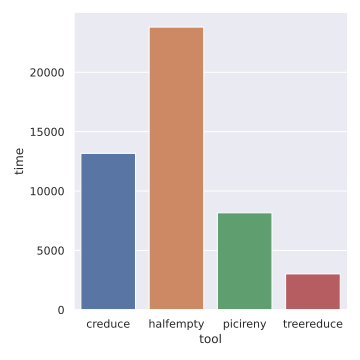
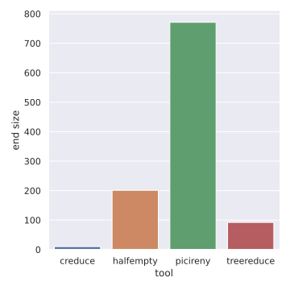

# Benchmarks

The following benchmarks compare C-reduce, Halfempty, Picireny, and
`treereduce` on C and C++ source code; see {doc}`the overview <overview>` for
general a general comparison of these tools.

As discussed in the overview, one would generally expect that, as the most
specialized tool, C-reduce will produce the smallest (highest-quality) outputs,
with Picireny and `treereduce` trailing it and Halfempty last.

```{note}
I am not an expert on many of the tools included in these benchmarks. I have
tried my best to understand them, but there may be more effective ways of using
them that would lead to better results.
```

## Time and quality

### Basic program

This benchmark involves running each tool with its default settings on a small
C program. The "interestingness test" is whether the program still compiles.

The following plots shows the time taken by the different tools (in
milliseconds), and the resulting program size (lower is better). They show that
`treereduce` is fastest, and produces the second-smallest (best) output file.




### Pre-processed "Hello, world!"

This benchmark involves running each tool with its default settings on a "hello
world" program, after running the C pre-processor. The "interestingness test"
is whether the program still compiles.

With a timeout of 300s, only `treereduce` was able to complete this task. It
reduced the file size from 35123 to 4769 bytes.

## Data collection

The data were collected using this script:

```sh
#!/usr/bin/env bash

set -e

rm -f data.csv

for tool in creduce halfempty picireny treereduce; do
  timeout 300s \
    cargo run --quiet --example bench -- \
      --config "${2:-default}" \
      --jobs "$(nproc)" \
      --oracle clang \
      --tool "${tool}" \
      "${1}" >> data.csv
done
```

